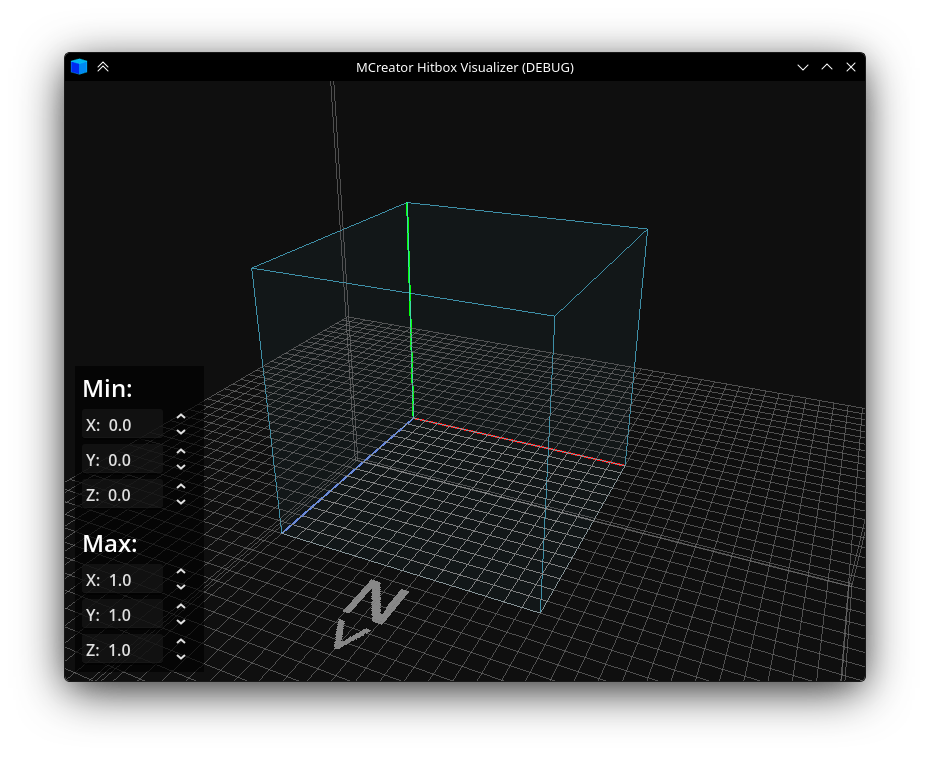

# Controls
**Middle Mouse Button** - Rotate camera.
**Middle Mouse Button + Shift** - Move camera.
**Mouse Wheel** - Zoom in/out.
**R** - Reset scene.
#
You can **Drag-and-Drop** .json models (works with 1.9-1.21.5 format).

